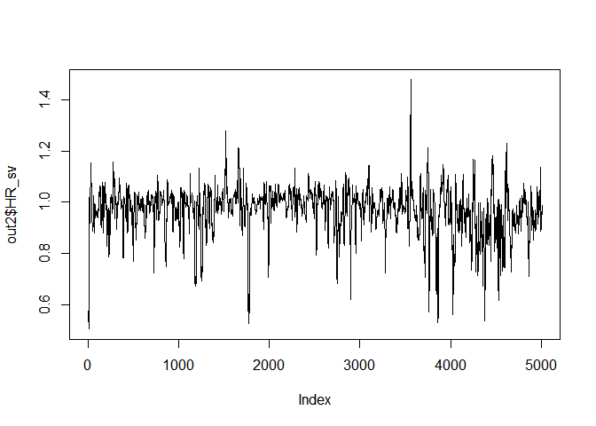

<!-- README.md is generated from README.Rmd. Please edit that file -->

# Hedge

<!-- badges: start -->

[](https://github.com/sieunyi/Hedge/actions)
<!-- badges: end -->

The goal of Hedge is to obtain optimal hedge ratios using two different
methods: one is traditionally used minimum variance hedge ratio, and the
other one is minimizing the semivariance hedge ratio. Based on obtained
hedge ratio, the hedging effectiveness is obtained and compared.

## Installation

You can install the released version of Hedge from
[CRAN](https://CRAN.R-project.org) with:

``` r
install.packages("Hedge")
```

And the development version from [GitHub](https://github.com/) with:

``` r
# install.packages("devtools")
devtools::install_github("sieunyi/Hedge")
```

## Example

This is a basic example which shows you how to solve a common problem:

``` r
library(Hedge)
```

To properly utilize this package, you first need to import two sets of
data: first column with spot price, second column with futures price
that you want to calculate the hedge ratio with. Next, name this data
set as x.

``` r
data(fx)
spot_price = fx$...1
futures_price = fx$...2
x = cbind(spot_price, futures_price)
```

Finally, call the function within the package defining the window length
you want to compare.

``` r

## basic example code
WinLen = 15
 out1 <- mvhr(x, WinLen)
 out2 <- svhr(x, WinLen) 
```


``` r
# compare hedge ratio
plot(out2$HR_sv, type= 'l', col=1)
lines(out1$HE, type='l', col=4)
```



In that case, don’t forget to commit and push the resulting figure
files, so they display on GitHub and CRAN.
